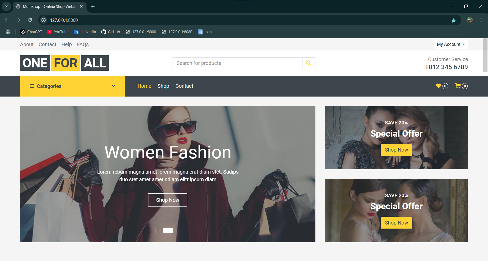
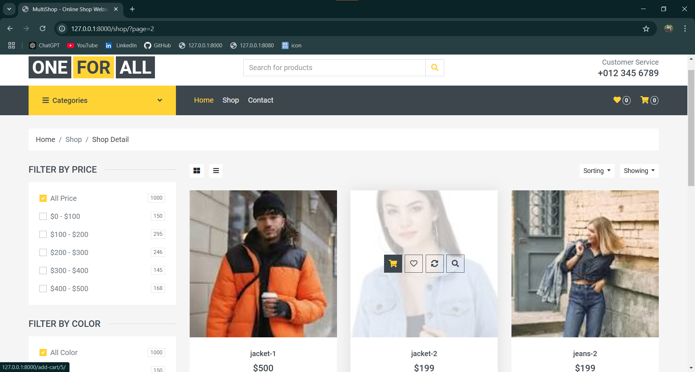
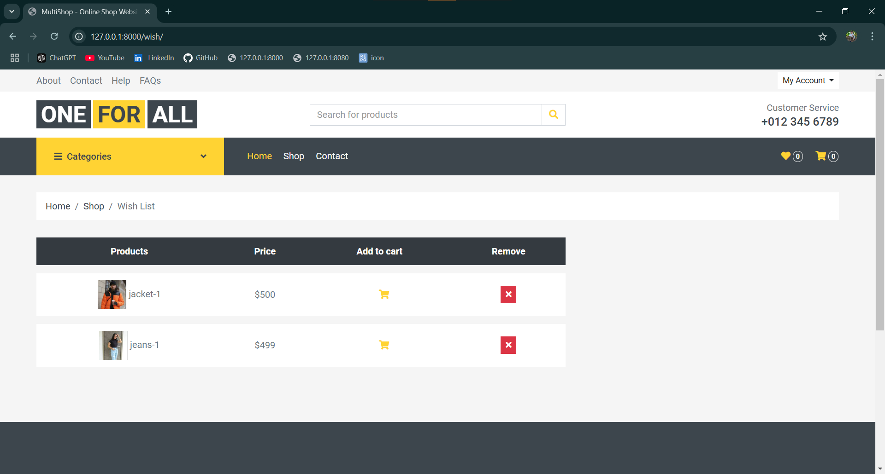
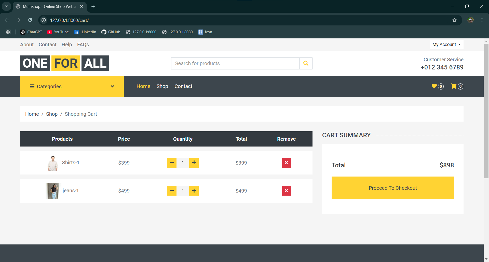
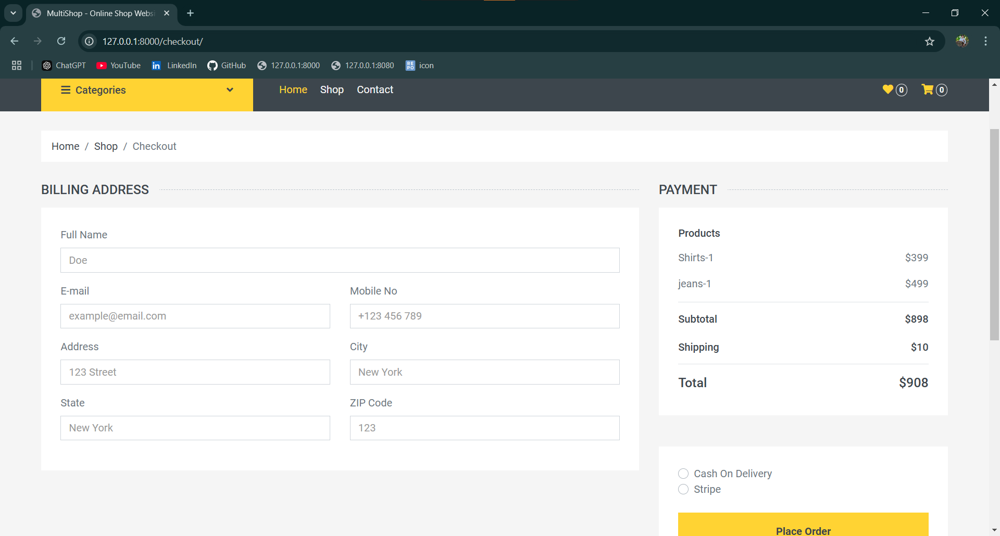

# Oneforall Clothing Website Project

## Description
The Oneforall project is a clothing website built with Python and Django for the backend, with HTML, CSS, and JavaScript for the frontend. This platform allows users to browse through a curated collection of clothing items, view product details, and make purchases online. The website is structured to provide a seamless shopping experience, allowing easy navigation and smooth transaction handling.

## Features
- User authentication and profile management
- Browse and search for clothing items
- View details for individual products
- Add items to the shopping cart and proceed to checkout
- Order tracking and purchase history
- Admin panel for inventory management

## Built With
- **Backend:** Django Framework (Python)
- **Frontend:** HTML, CSS, JavaScript
- **Database:** MySQL
- **Email:** SMTP (for user notifications)
- **Payment:** Stripe API integration

## Getting Started

### Prerequisites
- Python 3.8+ (3.11.6)
- Django 5.1.2
- MySQL
- Stripe account for payment processing (for live use)


### Installation
1. Clone the repository:
    ```bash
    git clone https://github.com/Rajesh2825/oneforall.git
    cd oneforall
    ```

2. Create a virtual environment (recommended):
    ```bash
    python -m venv env
    source env/bin/activate  # On Windows use `.\env\Scripts\activate`
    ```

3. Install dependencies:
    ```bash
    pip install -r requirements.txt
    ```

4. Set up your MySQL database:
   - Open MySQL and create a database named `oneforall`:
     ```sql
     CREATE DATABASE oneforall;
     ```
   - Execute the `oneforall.sql` file to set up the initial database schema:
     ```sql
     SOURCE path/to/your/oneforall.sql;
     ```


5. Set up environment variables: Create a `.env` file in the project root with the following structure:
    ```plaintext
    SECRET_KEY=your_django_secret_key
    EMAIL_HOST_USER=your_email@example.com
    EMAIL_HOST_PASSWORD=your_email_password
    DB_NAME=your_database_name
    DB_USER=your_database_user
    DB_PASSWORD=your_database_password
    DB_HOST=localhost
    DB_PORT=3306
    STRIPE_PUBLISHABLE_KEY=your_stripe_publishable_key
    STRIPE_SECRET_KEY=your_stripe_secret_key
    ```

6. Apply migrations:
    ```bash
    python manage.py makemigrations
    python manage.py migrate
    ```

7. Create a superuser (admin account):(optional)
    ```bash
    python manage.py createsuperuser
    ```

8. Run the development server:
    ```bash
    python manage.py runserver
    ```

9. Visit `http://127.0.0.1:8000` to see the website in action.

## Usage
- **Browse Products:** Users can explore various categories of clothing items.
- **User Authentication:** Users can register, log in, and manage their profiles.
- **Add to Cart:** Users can add products to their cart and proceed to checkout.
- **Payment:** Payment is processed through Stripe, ensuring secure transactions.


## Contributing
Contributions are welcome! Please fork the repository and create a pull request for any changes or improvements.


## Screenshots

### Home Page


### Product Page


### Wish list Page


### Shoping Cart Page


### Checkout Page


### Orders Page


## License
This project is licensed under the [MIT License](https://github.com/sibtc/django-multiple-user-types-example/blob/master/LICENSE).

## Contact
For any queries, please contact:

**Author:** Radadiya Rajesh  
